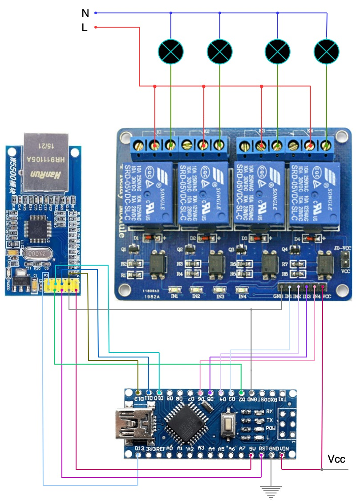

# 4 x Relay module

## Hardware
- Arduino Nano
- 4 x Arduino Relay Module
- W5500 Ethernet Shield

## Libraries
- SPI + Ethernet (Required by W5500)
- EthernetBonjour (MDNS)
- PubSubClient (MQTT)
  
