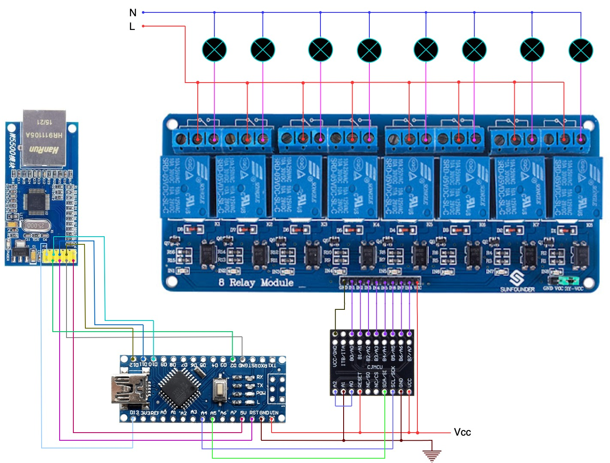

# 8 x Relay module

## Hardware
- Arduino Nano
- MCP23017 - 16-Bit I/O Expander with Serial Interface (I2C)
- 8 x Arduino Relay Module
- W5500 Ethernet Shield (SPI)

## Libraries
- SPI + Ethernet (Required by W5500)
- EthernetBonjour (MDNS)
- PubSubClient (MQTT)
- Wire (I2C)
  
