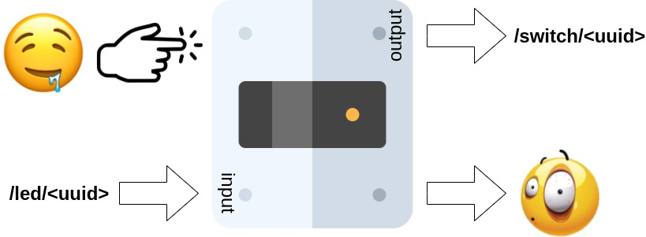
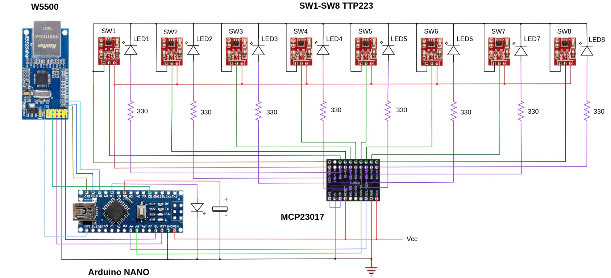

# 8 x State Switch

## Subscriptions
Device is subscribed to 8 topics `/led/<uuid>` (unique led identifier), only the last char of UUID is different, the rest is defined in `PREFIX`, for instance:
- `/led/86466b47-a7a1-4644-93ea-8e54a96e7c20`
- `/led/86466b47-a7a1-4644-93ea-8e54a96e7c21`
- `/led/86466b47-a7a1-4644-93ea-8e54a96e7c22`
- `. . . .`
- `/led/86466b47-a7a1-4644-93ea-8e54a96e7c27`

## Output topics
Device publishes command messages to 8 topics `/switch/<uuid>` (unique switch identifier), note that similr to led topics only the last char of UUID is different, the rest is defined in `PREFIX`, for instance:
- `/switch/86466b47-a7a1-4644-93ea-8e54a96e7c20`
- `/switch/86466b47-a7a1-4644-93ea-8e54a96e7c21`
- `/switch/86466b47-a7a1-4644-93ea-8e54a96e7c22`
- `. . . .`
- `/switch/86466b47-a7a1-4644-93ea-8e54a96e7c27`

## High level diagram

## Hardware
- Arduino Nano
- MCP23017 - 16-Bit I/O Expander with Serial Interface (I2C)
- TTP223 (Sensors)
- W5500 Ethernet Shield (SPI)

## Libraries
- SPI + Ethernet (Required by W5500)
- EthernetBonjour (MDNS)
- PubSubClient (MQTT)
- Wire (I2C)
  
