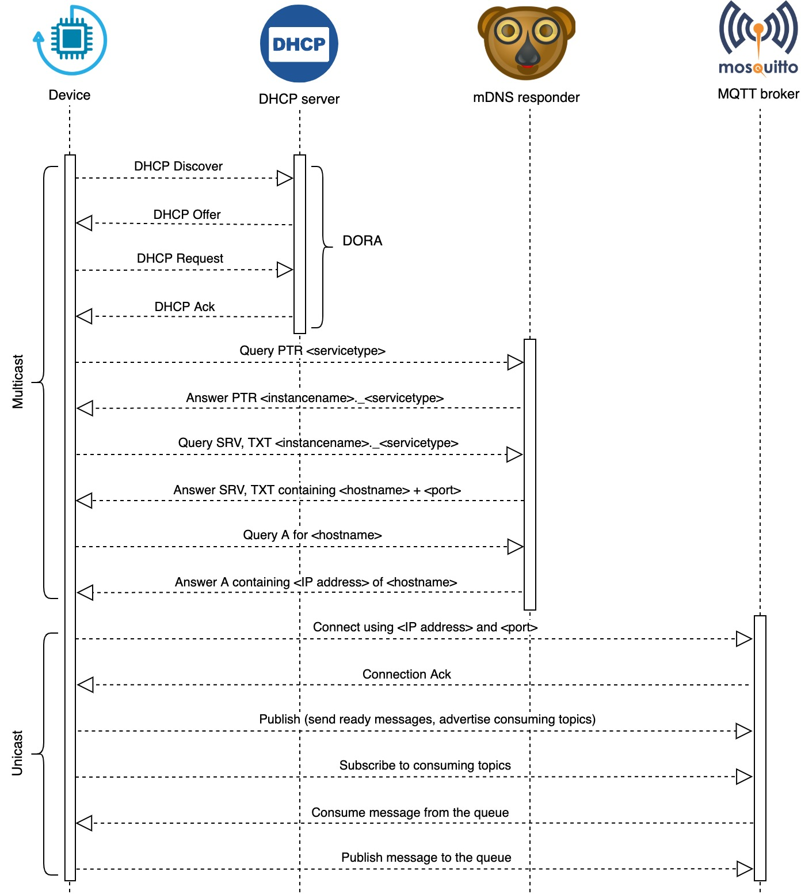

# Hardware devices
Devices for smart home automation

## Dependencies
- DHCP server for automatically assigning IP addresses and other communication parameters to devices connected to the network using a client–server architecture.
- MDNS (Multicast Domain Name Service) for instance Avahi.
- MQTT server (e.g. Mosquitto) for device communication.
- ELSA (MQTT routing tool/flow manager).

## Supported devices
- [4xRelayModule](./4xRelayModule/README.md)
- [8xRelayModule](./8xRelayModule/README.md)
- [8xStateSwitch](./8xStateSwitch/README.md)

## Network communication diagram

